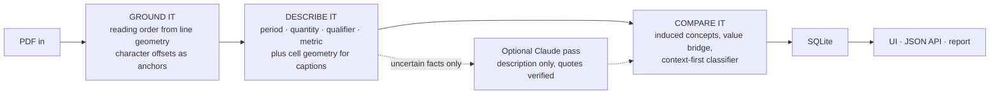
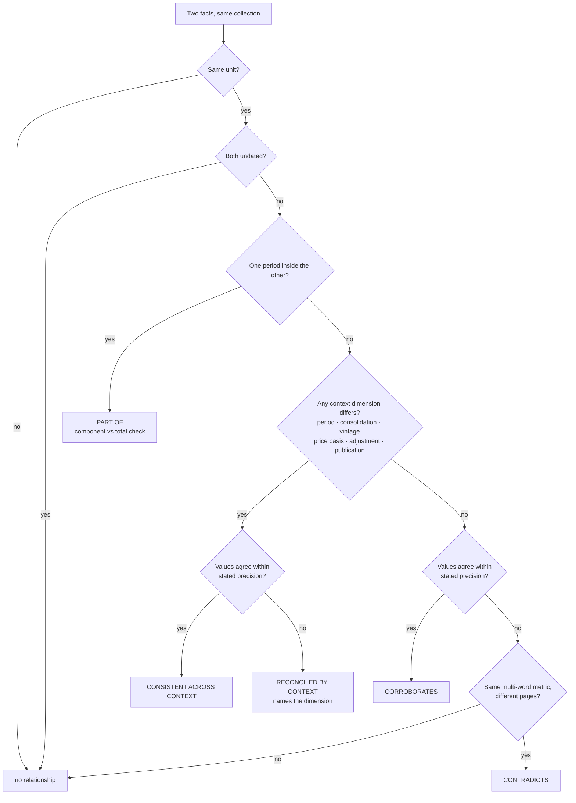

# Fact Knowledge Layer

Extracts numeric and semantic facts from PDFs, anchors every one of them to the
exact characters it came from, and works out where facts **corroborate**,
**contradict**, or **only appear to contradict** because they are stated on
different bases.

Built for the Superjoin engineering intern assignment (`docs/superjoin-vit-2026-assignment.pdf`).

On the six starter documents (511 pages) it extracts **4,818 grounded facts**
and derives **8,860 relationships** in **39 seconds**, with no API key and
no network access.

---

## Setup and run instructions

Requires Python 3.11+. No API key, no services, no network.

```bash
python3 -m venv .venv
.venv/bin/pip install -r requirements.txt

# Ingest the starter datasets. The folder name becomes the collection.
.venv/bin/python -m factlayer ingest data/starter

# Explore in the browser: upload PDFs, browse facts and relationships
.venv/bin/python -m factlayer serve          # http://127.0.0.1:8000
```

Other commands:

```bash
.venv/bin/python -m factlayer stats                     # what is in the layer
.venv/bin/python -m factlayer report --out cases.md     # the four cases, from live data
.venv/bin/python -m factlayer ingest some.pdf --collection acme --subject "Acme Ltd"
.venv/bin/python -m pytest                              # 96 tests, ~5s
```

Everything lands in `factlayer.db` (SQLite, override with `--db`). Ingesting the
same file twice is a no-op — documents are identified by content hash.

### Reproducing the demo exactly

```bash
.venv/bin/python -m factlayer ingest data/starter
.venv/bin/python -m factlayer ingest data/probe/probe-note-delhivery.pdf \
    --collection delhivery --subject "Delhivery"
.venv/bin/python -m factlayer ingest data/probe/probe-note-india.pdf \
    --collection india-macroeconomy --subject "India"
.venv/bin/python -m factlayer report --out docs/FOUR_CASES.md
```

The two files in `data/probe/` are **synthetic test fixtures** (generated by
`scripts/make_probe_pdf.py`, and labelled as such on their own first line). A
one-page note gives subject detection almost nothing to work with, hence the
explicit `--subject`. They exist because the six starter documents contain no high-confidence
cross-document contradiction — see Case 2 below.

### Optional: the Claude pass

Off by default; the system is complete without it.

```bash
pip install -r requirements-llm.txt
export ANTHROPIC_API_KEY=...        # or `ant auth login`
export FACTLAYER_LLM=anthropic
.venv/bin/python -m factlayer ingest some.pdf
```

---

## Video demo

**TODO — add link before submitting (3 minutes or less).**

The script is written and timed: **[`script.txt`](script.txt)** — 435 spoken
words, 2:55 at a normal pace, with a setup checklist, per-section timecodes, what
to have on screen, and the cuts to make in order if you run long.

---

## Approach

### The idea the whole system rests on

Two numbers that disagree are usually both correct. Revenue differs because one
figure is standalone and the other consolidated. Growth differs because one is
an advance estimate and the other an outturn. A quarter differs from a year
because it is a quarter.

So a fact is not `(metric, value)`. It is:

```
subject · metric · value · unit · period · basis · evidence
```

and two facts are only in conflict once **every** context dimension has been
ruled out. That inversion — context first, disagreement last — is what the
reasoning layer is.

### Pipeline

Source: [`architecture.mmd`](architecture.mmd).



**1. Reading order (`ingest/pdf.py`).** Naive extraction on a two-column report
interleaves the columns and welds half of one sentence onto half of another —
facts mined from those sentences are "grounded" in text that never existed. So
reading order is rebuilt from line geometry: find the widest whitespace gutter,
split, and recurse (publisher PDFs are often imposed as two-page spreads with
two columns inside each half — the Delhivery annual report is four columns per
sheet). A narrow gutter only counts as a column break if both sides read like
wrapped prose, which is what stops a numeric table being split into "columns".
Lines are then rejoined into paragraphs only when the previous line reached the
column margin, which is what keeps table rows out of prose.

Normalisation happens once, on the way in, so every `(page, start, end)` offset
recorded downstream indexes the stored page text exactly. A test asserts this
round-trip over the whole corpus.

**2. Facts (`extract/`).** Four parsers each own one dimension, and the metric
phrase is what is left over:

- `periods.py` canonicalises fiscal years by the calendar year they *end* in, so
  `FY24` (Delhivery), `2023-24` (RBI) and `FY2023/24` (IMF) resolve to one label.
  This single decision is what lets the three macro documents be compared at all.
- `quantities.py` normalises crore/lakh/million/billion, rupee and dollar
  symbols, percent, basis points and percentage points, and the accounting
  convention that parentheses mean negative. It also records **precision** — the
  size of the last stated digit — which the reasoning layer needs later.
- `qualifiers.py` reads context from `lexicon/qualifiers.json`: consolidation,
  vintage, adjustment, real/nominal, aggregation, comparison. The lexicon is
  data, extendable without touching code (`FACTLAYER_LEXICON` replaces it).
- `metrics.py` recovers the metric **syntactically**, not from a dictionary of
  known metrics — the documents are supposed to define what counts as a fact.
  A measurement reads `<metric> <linking verb> <qualifiers/period> <number>`, so
  it walks left from the number, steps over the spans the other parsers already
  claimed, and collects the governing noun phrase.

Attribution is where most of the work went, because proximity alone is wrong
often enough to matter: a period introduced by a temporal preposition right
after a value beats a nearer one (`X for FY24 was A against B for FY23`); a
relative reference (`5.4 per cent in the previous year`) shifts the period back;
a period inside a parenthetical that carries its own number belongs to that
number, not to the value outside; qualifiers do not reach across clauses.

**3. Layout-aware labels (`extract/layout.py`).** Decks and financial tables put
the number in one cell and its caption in another. Page text carries a cell
layer with offsets, and a value whose surrounding words name nothing is matched
to a caption by Jaccard overlap of their x-ranges. A bare number in a table row
also inherits period and basis from the headers above its column. **The caption
is never spliced into the evidence** — it is cited by its own span, so the fact
still points at real text on the page. This is what turned the Q4 deck from
metrics like `+ + Tons` into `revenue from services · ₹8,142 Cr · FY2024`.

**4. Concepts (`knowledge/concepts.py`).** There is no metric taxonomy. Concepts
are induced from corpus statistics: IDF over metric phrases makes "revenue"
cheap and "tonnage" expensive, and a new phrase joins the concept whose
*canonical* phrase it is closest to — matching any member instead would chain
"capital expenditure" to "revenue expenditure" through a shared neighbour.
Assignment is incremental, so a seventh PDF does not re-cluster the first six.

**5. Relationships (`knowledge/relations.py`, `linking.py`).** Two candidate
generators:

- **Concept blocks** — same concept, same unit, compatible subject.
- **The value bridge** — *different* concepts, but the same subject, unit and
  period, and values that agree within their stated precision. This is what
  connects `revenue from services ₹8,142 Cr` in a results deck to `revenue from
  operations ₹81,415.38 million` in the annual report. Nothing in the wording
  says they are the same measure; the grounded values and the context do.

Agreement is judged against the precision each document states, not a fixed
tolerance. `₹8,142 Cr` claims the nearest crore, so it stands for anything in
[8,141.5, 8,142.5] crore — and ₹81,415.38 million falls inside. Two figures both
written to one decimal, 6.4% and 6.5%, do not overlap: adjacent rounding buckets
stay distinct claims.

Then: if any context dimension differs and the values differ →
`reconciled_by_context`, naming the dimension. If nothing differs → `corroborates`
or `contradicts`. If one period sits inside the other → `part_of`, with a
component-versus-total sanity check.

The full decision, in one picture — source: [`reasoning.mmd`](reasoning.mmd):



### Engineering decisions and trade-offs

| Decision | Why | What it costs |
| --- | --- | --- |
| Rules by default, LLM optional | Runs with no key, no cost, no network; 511 pages in 40s; every step is inspectable and testable | Metric phrasing is weaker than a model's would be |
| **Collection**, not detected subject, is the comparison scope | Subject detection is unreliable on excerpted filings with no cover page — it reads the Q4 deck as "ESOPs" | The user must group related PDFs; mixing unrelated ones into one collection is their call |
| Precision-aware agreement | The right question is whether two *reported intervals* overlap, not whether two floats are close | Needs precision tracked from parse to comparison |
| SQLite, one file | The interesting part is discovery and comparison, not storage. FTS5 comes free | No concurrent writers |
| Contradiction has the strictest bar | It is the most consequential label: it needs matching multi-word metrics, both periods present and equal, and different pages | Real conflicts with thin phrasing are missed |
| Evidence is never synthesised | A caption from another cell is cited separately, so nothing shown as evidence is text the page does not contain | Two quotes to read instead of one |

### AI tools used

Claude (via Claude Code) was used throughout as a pair programmer: exploring the
PDFs, drafting modules, and — most usefully — hunting failures by reading the
output of each stage over the real corpus. Several of the fixes described above
came from an inspection loop rather than from a specification: the four-column
spread, the coincidental inflation bridge, the parenthetical period, the
de-hyphenation offset bug (caught by a test, then explained).

Claude also appears *inside* the system as the optional refiner
(`factlayer/llm/`), under a strict contract: it may only rewrite a fact's
description, never its value; its quotes are checked verbatim against the page;
its periods are re-parsed by this project's own parser; unknown context
dimensions are discarded.

---

## The four cases

Full evidence and reasoning: **[`docs/FOUR_CASES.md`](docs/FOUR_CASES.md)** —
generated by `factlayer report`, which selects each case by querying for its
*shape*, not by naming a document.

**1. Corroborated across documents, expressed differently.**
The FY24 annual report states revenue from operations as **₹81,415.38 million**;
the Q4 FY24 results deck states revenue from services as **₹8,142 Cr**. Different
words, different unit scale, different document. The system links them because
both are stated for Delhivery in FY2024 in the same unit and agree to within the
precision each claims (a gap of 0.006%, inside the ±half a crore that
"₹8,142 Cr" implies). The deck's caption was recovered from a different cell on the slide.

**2. A genuine or likely contradiction.**
*No high-confidence cross-document contradiction survives the context checks on
the six starter documents* — a real result, not a gap: they are official
publications largely drawing on the same national statistics, and the apparent
conflicts all resolve into period, basis or vintage differences. To show the
detector working, `data/probe/` contains two labelled synthetic notes that
restate corpus figures on the same basis and period with different numbers. The
system catches every one, e.g. express parcel shipments in FY24 reported as
**705 Mn** against the deck's **740 Mn**, with no differentiating context.

**3. An apparent contradiction explained by context.** Three flavours, each
isolated to a single dimension:
- **Consolidation** — one annual report page states FY24 revenue as ₹74,540.82
  million *standalone* and ₹81,415.38 million *consolidated*.
- **Price basis** — one IMF page states FY2024/25 GDP growth as 6.5% *real* and
  9.8% *nominal*.
- **Vintage** — the Economic Survey's current-account deficit for Q2 FY25 against
  the IMF's *projection* for the full year. The layer also holds the crispest
  version of this, which the report's ranking does not happen to pick: the
  Economic Survey's 6.4% FY25 growth is a *first advance estimate* and the IMF's
  6.5% for the same year is an outturn — search `advance` in the Facts tab.

**4. An extraction or reasoning failure.** `docs/FOUR_CASES.md` ends with the
system auditing itself from the store (share of facts with no period, with a
single-word metric, in incomparable units). Three failures found by inspection,
and what was done about each:

- **Two-column reading order.** The RBI annual report's columns interleaved, so
  "real GDP growth for 2025-26 is projected at 6.5 per cent" was welded to a
  sentence about AI models. *Fixed* — recursive gutter detection; the page now
  reads correctly. Reconstruction is reported per page in the UI.
- **A coincidental value bridge.** Headline inflation and core inflation both
  read 4.6% for FY25, and the bridge declared them the same measure. *Mitigated*
  — a bridge is refused when two phrases share a head noun but carry contrasting
  modifiers, which is exactly that shape. Weaker variants can still slip through;
  the honest fix is to require corroboration across more than one period.
- **Thin metric phrases.** When the governing noun sits in an earlier clause
  ("Non-Resident Indian deposits, with net inflows increasing to…"), the phrase
  collapses to "net inflows" and two unrelated series can collide. *Partly
  fixed* — a bare derivative noun now walks back to its subject; contradictions
  now require multi-word metrics. This is the main remaining source of error and
  the reason the optional LLM pass targets exactly these facts.

---

## Limitations and next steps

**What does not work well yet**

- **Metric phrasing is the weakest link.** 23% of facts have a single-word
  metric. The syntactic walk is clause-local, so a subject established earlier
  in the sentence is missed.
- **Table cells are only half-solved.** A row's label and its column header are
  recovered, but a cell is not tied to *both* axes of a nested header. Numbers in
  wide financial tables therefore often end up without a period (59% of all facts
  have none, mostly from tables).
- **Subject detection is unreliable** on excerpted documents with no cover page
  (5 of 6 correct after legal-suffix weighting; the prospectus reads as "India").
  It is a display hint only — `--subject` overrides it.
- **No state facts yet.** The system handles quantities. The assignment's
  director example (active in a prospectus, resigned in a later report) needs a
  state-fact extractor with temporal supersession; the identifiers that make it
  tractable (`DIN: 01173669`) are already recognised and skipped as non-values.
- **Charts are invisible.** Values that exist only as bar heights are not read.
- **The LLM path is unverified against the live API.** It has no credentials in
  this environment; its logic is covered by tests driven by a stub client.

**What I would build next, in order**

1. **State facts and supersession** — role/status assertions keyed on stable
   identifiers, with `superseded_by` when a later document reports a change.
   This is the biggest gap against the brief.
2. **Full table understanding** — treat a table as a grid and resolve each cell
   against both its row label and its (possibly nested) column header, instead of
   the current one-directional inheritance.
3. **Turn linking into retrieval** — embeddings over metric phrases would replace
   the IDF clustering and catch "total income" ≈ "revenue" without a value
   coincidence to bridge them.
4. **Calibrate confidence** — hand-label a few hundred relationships and fit the
   scores, so "0.85" means something measurable.
5. **Cross-currency comparison** — USD and INR facts are currently incomparable
   by design; a dated FX table would let the IMF and RBI external-sector numbers
   meet.

---

## Additional notes

- **Repository layout**

  ```
  factlayer/
    ingest/      reading order, normalisation, segmentation
    extract/     periods, quantities, qualifiers, metrics, subjects, layout, rules
    knowledge/   concept induction, candidate generation, relation classification
    store/       SQLite schema and queries
    api/         FastAPI app + single-page UI (no build step)
    llm/         optional Claude refiner
  data/starter/  the six provided PDFs
  data/probe/    two labelled synthetic notes (see Case 2)
  docs/          assignment brief, generated four-case report
  samples/       committed sample input and output, for evaluation without running
  architecture.mmd  reasoning.mmd  script.txt
  ```

  ~4,200 lines of Python, ~750 lines of tests.

- **Sample output** is committed under `samples/output/` (stats, facts, and each
  relationship kind as JSON, plus the four-case report), so the system can be
  evaluated without running it. Regenerate with `scripts/export_samples.py`.

- **Runs are reproducible.** Ingesting the same PDFs twice produces byte-identical
  counts; a test asserts it.

- **Nothing is keyed to the starter documents.** No filenames, no document
  fingerprints, no metric whitelist. The two domain lexicons that exist
  (`lexicon/qualifiers.json`, the function-word lists in `extract/metrics.py`)
  are general to financial and statistical writing and are data, not control flow.

- **Scale.** Ingest is incremental: a new document is compared only against the
  facts already stored for its collection, so cost grows with the size of the
  document being added, not the size of the layer. 511 pages take ~40s and the
  largest document ~14s. `python -m factlayer ingest <dir>` walks directories.

- **No credentials are required or stored.** The default path never makes a
  network call.
